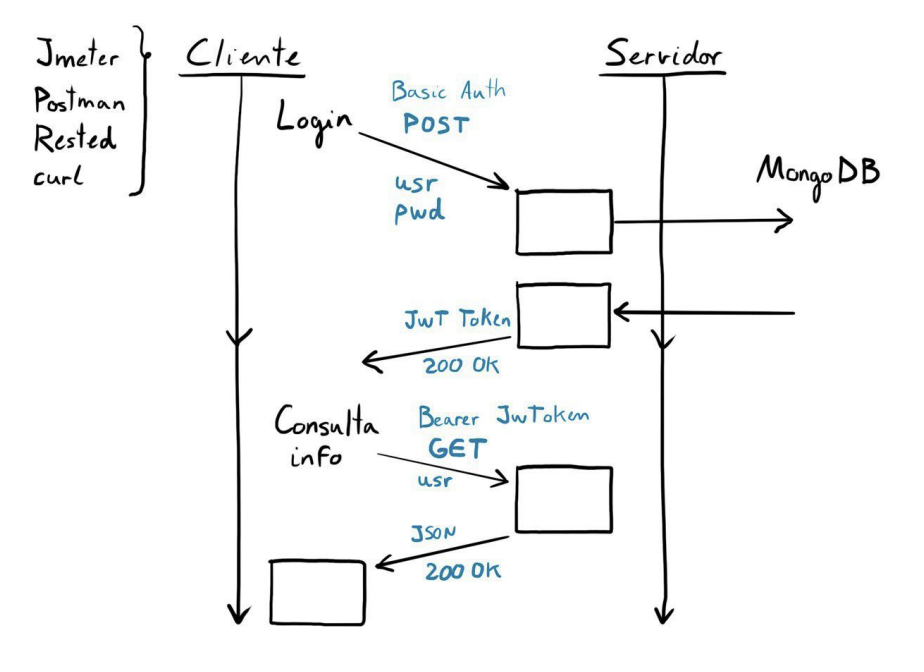

# CONCEPTOS

## Benchmark

Un benchmark es un proceso o conjunto de pruebas diseñado para evaluar el rendimiento, la calidad o las características de un sistema, dispositivo, componente o aplicación en comparación con otros.

A la hora de crear nuestro propio benchmark (porque deseemos medir un parámetro concreto y lo queremos proogramar nosotros), debemos tener en cuenta lo siguiente:

1. Objetivo del benchmark.
2. Métricas (unidades, variables, puntuaciones, etc.).
3. Instrucciones para su uso.
4. Ejemplo de uso analizando los resultados.

## Phoronix

Phoronix es una plataforma que permite ejecutar un conjunto de benchmarks bajo la agrupación openbenchmarking.org

## Apache Benchmark

Dentro de los benchmarks más populares para servidores web podemos encontrar la herramienta para “Apache HTTP server benchmarking ”(comando ab):

**ab** es una herramienta para evaluar el rendimiento de tu servidor HTTP Apache. Está diseñada para brindarte una impresión de cómo se desempeña tu instalación actual de Apache. Esto te muestra especialmente cuántas solicitudes por segundo es capaz de manejar tu instalación de Apache.

## Jmeter

JMeter es una herramienta de prueba de carga y rendimiento desarrollada por Apache Software Foundation. Se utiliza para medir el rendimiento de una aplicación web o de otro tipo bajo cargas simuladas.

JMeter puede simular múltiples usuarios concurrentes enviando solicitudes a un servidor o aplicación y analizar cómo responde bajo una carga determinada. Esto permite identificar cuellos de botella, problemas de rendimiento y limitaciones del sistema.

Además, Jmeter puede crear concurrencia real debido a la posibilidad de usar varias hebras dentro de la mismas CPU así como distribuir
la creación de carga en varias máquinas. La posibilidad de ejecutarse en modo de línea
de comandos permite aligerar la carga de la máquina que está generando las peticiones
al servidor además de permitir la automatización de ciertos tests.

## Contendor
Unidad ejecutable de software en la que el código de la aplicación se empaqueta, junto con sus bibliotecas y dependencias, de manera común para que se pueda ejecutar en cualquier lugar.

## Docker
Plataforma de contenedor de software diseñada para desarrollar, enviar y ejecutar aplicaciones aprovechando la tecnología de los contenedores. Docker se presenta en dos versiones: edición empresarial y edición de comunidad.

Los desarrolladores pueden crear, empaquetar, enviar y ejecutar aplicaciones fácilmente en forma de contenedores ligeros, portátiles y autosuficientes que pueden utilizarse en prácticamente cualquier lugar. Los contenedores permiten a los desarrolladores empaquetar una aplicación con todas sus dependencias y desplegarla como una sola unidad. Al proporcionarles contenedores de aplicaciones precompilados y autosuficientes, los desarrolladores pueden centrarse en el código de la aplicación y utilizarlo sin preocuparse por el sistema operativo subyacente ni por el sistema de implementación.

Un contenedor de Docker es una instancia en ejecución de una imagen de Docker. Sin embargo, a diferencia de la virtualización tradicional con un hipervisor de tipo 1 o tipo 2, un contenedor de Docker se ejecuta en el núcleo del sistema operativo host. Dentro de una imagen de Docker no existe un sistema operativo independiente, como se ilustra en la Figura

## Prueba de carga

Una prueba de carga es una actividad que se realiza para evaluar el rendimiento y la capacidad de una aplicación o sistema bajo una carga específica. El objetivo es simular condiciones reales y determinar cómo responde el sistema, ya sea una aplicación web, un servicio en la nube o cualquier otro tipo de software, cuando es sometido a una carga de trabajo significativa. La prueba de carga busca identificar posibles cuellos de botella, problemas de rendimiento, tiempo de respuesta y estabilidad del sistema en condiciones de alta demanda.

## Preguntas relacionadas con JMeter

### ¿Qué contienen los CVS introducidos en JMeter?
Los elementos de configuración "CSV Data Set config" se usan para visualizar lineas de un archivo dado y pueden ser divididas en las variables que se requieran. En nuestro caso, dichos archivos contienen las credenciales de alumnos y administradores con su correo y password.

### De cara a realizar un test con muchas hebras y con carga de CPU...
Usaremos la interfaz de línea de comandos de Jmeter. ¿Por qué?

La interfaz de línea de comandos (CLI) de JMeter ofrece varias ventajas cuando se trata de medir un test con muchas hebras y carga de CPU:

1. Mayor control y automatización: La interfaz CLI permite ejecutar pruebas de JMeter de forma automatizada y programática a través de scripts o comandos. Esto es útil cuando se necesita ejecutar pruebas repetidamente o como parte de un proceso de integración continua.

2. Eficiencia y recursos: Ejecutar pruebas con muchas hebras y carga de CPU puede consumir una cantidad significativa de recursos de la máquina. Al utilizar la interfaz CLI, puedes ejecutar JMeter en un entorno de línea de comandos, lo que puede liberar recursos del sistema en comparación con la ejecución a través de la interfaz gráfica de usuario (GUI). Esto es especialmente importante cuando se trabaja con un gran número de hebras y se necesita optimizar la utilización de recursos.

3. Escalabilidad y rendimiento: Al ejecutar JMeter a través de la CLI, es posible aprovechar mejor la escalabilidad y el rendimiento de tu sistema. Puedes configurar tu infraestructura de pruebas para ejecutar JMeter en varias máquinas en paralelo, distribuyendo la carga de las pruebas y obteniendo resultados más rápidos y eficientes.

4. Integración con herramientas y procesos existentes: La interfaz CLI permite una fácil integración con otras herramientas y procesos de automatización. Puedes combinar JMeter con sistemas de gestión de pruebas, sistemas de control de versiones o herramientas de programación para crear flujos de trabajo más complejos y personalizados.

En resumen, la interfaz de línea de comandos de JMeter es preferible en situaciones donde se necesita un mayor control, automatización, eficiencia de recursos, escalabilidad y rendimiento. Sin embargo, la elección entre la interfaz CLI y la interfaz gráfica de usuario depende de tus necesidades específicas y preferencias.

### ¿A qué puerto haces las peticiones Jmeter en la aplicación de prácticas? 
Al puerto 3000.

### ¿Para qué es la primera petición que se realiza en la aplicación de prácticas?
Para recuperar el token que identifica al usuario logeado correctamente.

### ¿Para qué se plantean 2 hebras en la aplicación de JMeter?
Para lograr concurrencia entre alumnos y administradores, simulando un entorno más real.

### ¿Dónde se tiene que añadir el token de login?
A la cabecera HTTP de la segunda petición.

### ¿Para qué se usa en la práctica el elemento Regular Expression Extractor de JMeter?
Para recuperar el JWT de la respuesta dada por el servidor a la petición POST.

### ¿Para qué se ha utilizado el elemento Gaussian Random Timer de JMeter?
Para establecer un tiempo de espera aleatorio entre cada petición POST y GET.

### ¿Para qué se ha utilizado la petición GET en la práctica?
Para obtener el JSON con la información del alumno.

### Al hacer el test de JMeter ¿Dónde generamos carga?
En el contenedor de la API, en el de la BD, en la MV que los contiene y en el cliente que lanza el test.

### Para qué ha utilizado en la práctica el elemento Access Log Sampler de JMeter?
Para a partir de un fichero ".log", generar automáticamente una serie de peticiones y registrar las respuestas generadas.

## Preguntas relacionadas con Phoronix

### Phoromatic es una interfaz que se utiliza para...
Orquestar y automatizar la ejecución de benchmarks en múltiples máquinas.

### ¿Qué comando usamos para lanzar un benchmark con Phoronix (por ejemplo, "sudokut")?
phoronix-test-suite run sudokut

### ¿Cómo se instala un test en phoronix?
phoronix-test-suite install nombreDelTest

## Preguntas relacionadas con Apache Benchmark(ab) o Benchmarking

### ¿Cuál es el resultado de ejecutar "ab -n 10 -c 5 192.168.56.110"?

Ejecuta un benchmark con 10 peticiones HTTP en total, siendo 5 de ellas concurrentes.

### ¿Tiene sentido aplicar el test a la misma máquina desde donde ejecutamos ab?

No, ya que el resultado va a estar afectado por la capacidad de la máquina para generar la carga, lo cual afecta a su vez a la capacidad para servir peticiones.

### Benchmarking es...
... aplicar una carga mientras monitorizamos un sistema, para comprobar cómo podría responder nuestro sistema ante cargas similares.

### ¿Podemos comparar el performance de dos servidores realizando el test desde una máquina a la otra y viceversa?
Sí, pero la comparación no sería justa.

## Preguntas relacionadas con contenedores

### ¿Cuales son las ventajas de un contenedor frente a una Máquina Virtual?

Los contenedores ocupan menos espacio, requieren menos recursos y son más veloces en el arranque.

## Preguntas relacionadas con Ajuste del Sistema

### El ajuste de sistema es...
... modificar parámetros del sistema para optimizar su funcionamiento, según los resultados que obtenemos mediante monitorización.